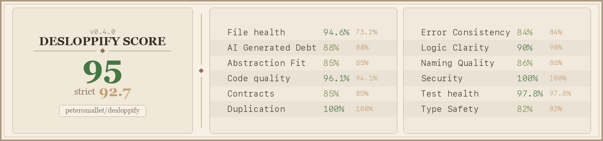

# Desloppify - agent tools to make your codebase 🤌

Detects subjective and mechanical code-base issues - everything from poor quality abstractions and inconsistent naming, to file complexity and duplication. Once identified, it tracks issues, and helps you work with your agents to relentlessly solve them. Currently supports TypeScript, Python, and C#/.NET.

Every scan generates a scorecard badge you can add to your README — here's the one for this repo. Strict score counts open + wontfix debt; ignored findings are tracked separately:



Adding a new language plugin? See `ADDING_A_NEW_LANGUAGE.md`.

## For your agent's consideration...

Copy-paste into any AI coding agent (Cursor, Codex, OpenCode, etc.):

```
Install or update desloppify, then scan this codebase for code quality issues (dead code,
duplication, complexity, smells). It tracks findings and reports a health score.

pip install --upgrade git+https://github.com/peteromallet/desloppify.git
desloppify scan --path .
desloppify status
desloppify next

--path is the directory to scan (use "." for the whole project, or "src/" etc).
Language is auto-detected. To override: desloppify --lang python scan --path .
(note: --lang goes BEFORE the subcommand)

Fix what it finds, then "desloppify resolve fixed <id>" and rescan.
For intentional debt: "desloppify resolve wontfix <id> --note 'reason'" (note is required).
For detector mistakes: "desloppify resolve false_positive <id>".
Keep going until all issues are resolved. If you notice anything wrong or confusing about
desloppify itself, tell me and ask if I want you to log an issue. If you need to understand
how desloppify works or debug an issue: git clone https://github.com/peteromallet/desloppify.git /tmp/desloppify

If you're Claude Code, also run:
mkdir -p .claude/skills/desloppify && { curl -fsSL https://raw.githubusercontent.com/peteromallet/desloppify/main/SKILL.md; printf '\n\n'; curl -fsSL https://raw.githubusercontent.com/peteromallet/desloppify/main/skills/CLAUDE.md; } > .claude/skills/desloppify/SKILL.md

If you're Codex, also run:
mkdir -p .agents/skills/desloppify "${CODEX_HOME:-$HOME/.codex}/skills/desloppify" && { curl -fsSL https://raw.githubusercontent.com/peteromallet/desloppify/main/SKILL.md; printf '\n\n'; curl -fsSL https://raw.githubusercontent.com/peteromallet/desloppify/main/skills/CODEX.md; } | tee .agents/skills/desloppify/SKILL.md > "${CODEX_HOME:-$HOME/.codex}/skills/desloppify/SKILL.md"

If you're using OpenSkills (Cursor/Windsurf/Cline/OpenCode), also run:
npx -y openskills install peteromallet/desloppify --yes
npx -y openskills sync --yes
```

## From Vibe Coding to Vibe Engineering

Vibe coding gets things built fast. But the codebase accumulates debt - dead code, duplication, tangled dependencies - and eventually progress slows, bugs get harder to fix, and new features become a pain.

Thankfully, both subjective and objective engineering best practices exist - and, with a little help from agents, they can be tracked. Desloppify is for people who want to keep the speed of agent-driven development while pushing themselves to a standard that rivals traditional engineering teams.

It handles the mechanical layer automatically: scan, detect, auto-fix what it can. For the rest - architectural fitness, convention drift, things that need taste - it gives your agent a prioritized shortlist. You decide what to fix and what to mindfully ignore. The goal is to capture all of this in a single score that combines both objective and subjective metrics - a real measure of the health of your codebase.

If you'd like to join a community of vibe engineers who want to build beautiful things, [come hang out](https://discord.gg/aZdzbZrHaY).


---

<details>
<summary><strong>Stuff you probably won't need to know</strong></summary>

#### Commands

| Command | Description |
|---------|-------------|
| `scan` | Run all detectors, update state |
| `status` | Score + per-tier progress |
| `explain` | Explain strict-score loss hotspots and priorities |
| `help-me-improve` | Alias for `explain` |
| `show <pattern>` | Findings by file, directory, detector, or ID |
| `next [--tier N]` | Highest-priority open finding |
| `resolve <status> <patterns>` | Mark fixed / wontfix / false_positive / ignore |
| `fix <fixer> [--dry-run]` | Auto-fix mechanical issues |
| `review --prepare` | Generate subjective review packet (`query.json`) |
| `review --import <file>` | Import subjective review findings |
| `issues` | Review findings queue (list/show/update) |
| `zone` | Show/set/clear zone classifications |
| `config` | Show/set/unset project configuration |
| `move <src> <dst>` | Move file/directory, update all imports |
| `detect <name>` | Run a single detector raw |
| `plan` | Prioritized markdown plan |
| `tree` | Annotated codebase tree |
| `viz` | Interactive HTML treemap |
| `dev scaffold-lang` | Generate a standardized language plugin scaffold |
| `help [command]` | Show top-level or command-specific help |

#### Detectors

**TypeScript/React**: logs, unused, exports, deprecated, large, complexity, gods, single_use, props, passthrough, concerns, deps, dupes, smells, coupling, patterns, naming, cycles, orphaned, react

**Python**: unused, large, complexity, gods, props, smells, dupes, deps, cycles, orphaned, single_use, naming

**C#/.NET**: deps, cycles, orphaned, dupes, large, complexity

#### Tiers & scoring

| Tier | Fix type | Examples |
|------|----------|----------|
| T1 | Auto-fixable | Unused imports, debug logs |
| T2 | Quick manual | Unused vars, dead exports |
| T3 | Needs judgment | Near-dupes, single_use abstractions |
| T4 | Major refactor | God components, mixed concerns |

Score is weighted (T4 = 4x T1).
- Lenient/overall score treats `open` findings as debt.
- Strict score treats both `open` and `wontfix` findings as debt.
- `status` also reports `strict_all_detected`, which includes ignored and zone-excluded findings from the latest scan.
- Default subjective dimensions: `naming_quality`, `error_consistency`, `abstraction_fitness`, `logic_clarity`, `ai_generated_debt`, `type_safety`, `contract_coherence`.
- Assessment dimensions are normalized to canonical names; unknown keys are ignored unless you opt into explicit `custom_` dimensions.

#### Configuration

| Variable | Default | Description |
|----------|---------|-------------|
| `DESLOPPIFY_ROOT` | cwd | Project root |
| `DESLOPPIFY_SRC` | `src` | Source directory (TS alias resolution) |
| `--lang <name>` | auto-detected | Language selection (each has own state) |
| `--exclude <dirs>` | none | Directories to skip (e.g. `--exclude migrations tests`) |
| `--no-badge` | false | Skip scorecard image generation |
| `--badge-path <path>` | `assets/scorecard.png` | Output path for scorecard image |
| `DESLOPPIFY_NO_BADGE` | — | Set to `true` to disable badge via env |
| `DESLOPPIFY_BADGE_PATH` | `assets/scorecard.png` | Badge output path via env |

Project config values (stored in `.desloppify/config.json`) are managed via:
- `desloppify config show`
- `desloppify config set target_strict_score 95` (default: `95`, valid range: `0-100`)

#### Adding a language

Use the scaffold workflow documented in `ADDING_A_NEW_LANGUAGE.md`:

```bash
desloppify dev scaffold-lang <name> --extension .ext --marker <root-marker>
```

Detect command keys are standardized to snake_case. CLI compatibility aliases
like `single-use` and legacy `passthrough` are still accepted.
Standard plugin shape: `__init__.py`, `commands.py`, `extractors.py`, `phases.py`,
`move.py`, `review.py`, `test_coverage.py`, plus `detectors/`, `fixers/`, and `tests/`.
Validated at registration. Zero shared code changes.

#### Architecture

```
detectors/              ← Generic algorithms (zero language knowledge)
lang/base.py            ← Shared finding helpers
lang/<name>/            ← Language config + phases + extractors + detectors + fixers
```

Import direction: `lang/` → `detectors/`. Never the reverse.

</details>
