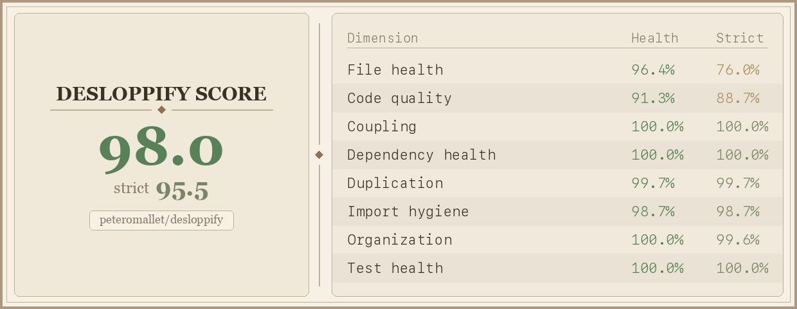

# Desloppify - agent tools to make your codebase 🤌

Codebase health scanner. Detects cruft (dead code, duplication, complexity, smells), tracks findings across scans, auto-fixes mechanical issues, reports a weighted score. It gives you a shortlist of issues to either solve with your agent or mindfully ignore. TypeScript/React and Python out of the box, but you can get your agent to add any language.

Every scan generates a scorecard badge you can add to your README — here's the one for this repo - the strict score includes the ones you've ignored that haven't been solved:



## For your agent's consideration...

Copy-paste into any AI coding agent (Cursor, Codex, Copilot, etc.):

```
Install or update desloppify, then scan this codebase for code quality issues (dead code,
duplication, complexity, smells). It tracks findings and reports a health score.

pip install --upgrade git+https://github.com/peteromallet/desloppify.git
desloppify scan --path .
desloppify status
desloppify next

--path is the directory to scan (use "." for the whole project, or "src/" etc).
Language is auto-detected. To override: desloppify --lang python scan --path .
(note: --lang goes BEFORE the subcommand)

Fix what it finds, then "desloppify resolve fixed <id>" and rescan. For false positives:
"desloppify resolve wontfix <id> --note 'reason'" (note is required — don't skip work).
Keep going until all issues are resolved. If you notice anything wrong or confusing about
desloppify itself, tell me and ask if I want you to log an issue. If you need to understand
how desloppify works or debug an issue: git clone https://github.com/peteromallet/desloppify.git /tmp/desloppify

If you're Claude Code, also run:
mkdir -p .claude/skills/desloppify && curl -sL https://raw.githubusercontent.com/peteromallet/desloppify/main/SKILL.md -o .claude/skills/desloppify/SKILL.md
```

## From Vibe Coding to Vibe Engineering

Vibe coding gets things built fast. But the codebase accumulates debt — dead code, duplication, tangled dependencies — and eventually progress slows, bugs get harder to fix, and new features become a pain.

Thankfully, both subjective and objective engineering best practices exist — and they can be tracked. Desloppify is for people who want to keep the speed of agent-driven development while pushing themselves to a standard that rivals traditional engineering teams.

It handles the mechanical layer automatically: scan, detect, auto-fix what it can. For the rest — architectural fitness, convention drift, things that need taste — it gives your agent a prioritized shortlist. You decide what to fix and what to mindfully ignore. Every finding is either resolved or dismissed with a reason. No lint noise, no guilt — just steady, visible progress.

The goal is to capture all of this in a single score that combines both objective and subjective metrics — a real measure of the health of your codebase.

If you'd like to join a community of vibe engineers who want to build beautiful things, [come hang out](https://discord.gg/aZdzbZrHaY).


---

<details>
<summary><strong>Stuff you probably won't need to know</strong></summary>

#### Commands

| Command | Description |
|---------|-------------|
| `scan` | Run all detectors, update state |
| `status` | Score + per-tier progress |
| `show <pattern>` | Findings by file, directory, detector, or ID |
| `next [--tier N]` | Highest-priority open finding |
| `resolve <status> <patterns>` | Mark fixed / wontfix / false_positive |
| `ignore <pattern>` | Suppress findings matching a pattern |
| `fix <fixer> [--dry-run]` | Auto-fix mechanical issues |
| `move <src> <dst>` | Move file/directory, update all imports |
| `detect <name>` | Run a single detector raw |
| `plan` | Prioritized markdown plan |
| `tree` | Annotated codebase tree |
| `viz` | Interactive HTML treemap |

#### Detectors

**TypeScript/React**: logs, unused, exports, deprecated, large, complexity, gods, single-use, props, passthrough, concerns, deps, dupes, smells, coupling, patterns, naming, cycles, orphaned, react

**Python**: unused, large, complexity, gods, passthrough, smells, dupes, deps, cycles, orphaned, single-use, naming

#### Tiers & scoring

| Tier | Fix type | Examples |
|------|----------|----------|
| T1 | Auto-fixable | Unused imports, debug logs |
| T2 | Quick manual | Unused vars, dead exports |
| T3 | Needs judgment | Near-dupes, single-use abstractions |
| T4 | Major refactor | God components, mixed concerns |

Score is weighted (T4 = 4x T1). Strict score excludes wontfix.

#### Configuration

| Variable | Default | Description |
|----------|---------|-------------|
| `DESLOPPIFY_ROOT` | cwd | Project root |
| `DESLOPPIFY_SRC` | `src` | Source directory (TS alias resolution) |
| `--lang <name>` | auto-detected | Language selection (each has own state) |
| `--exclude <dirs>` | none | Directories to skip (e.g. `--exclude migrations tests`) |
| `--no-badge` | false | Skip scorecard image generation |
| `--badge-path <path>` | `scorecard.png` | Output path for scorecard image |
| `DESLOPPIFY_NO_BADGE` | — | Set to `true` to disable badge via env |
| `DESLOPPIFY_BADGE_PATH` | `scorecard.png` | Badge output path via env |

#### Adding a language

Create `desloppify/lang/<name>/` with `__init__.py`, `commands.py`, `extractors.py`, `detectors/`, `fixers/`. Validated at registration. Zero shared code changes. See `lang/python/` for example.

#### Architecture

```
detectors/              ← Generic algorithms (zero language knowledge)
lang/base.py            ← Shared finding helpers
lang/<name>/            ← Language config + phase runners + extractors + detectors + fixers
```

Import direction: `lang/` → `detectors/`. Never the reverse.

</details>
